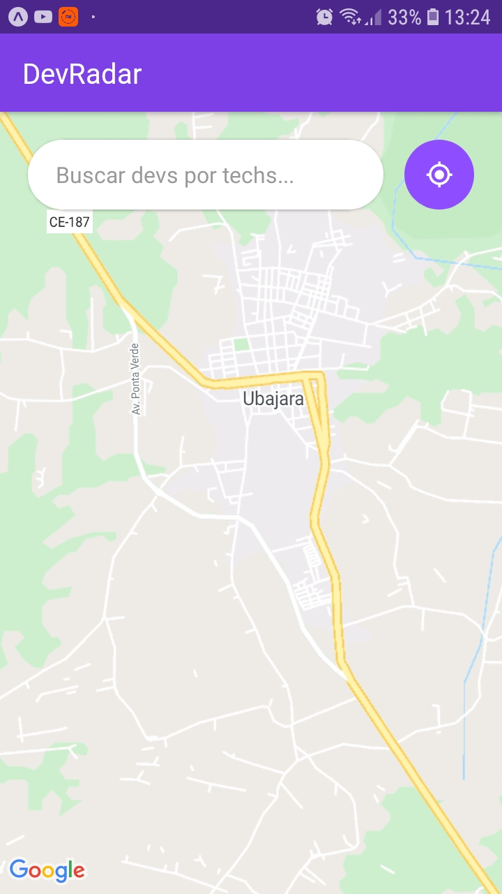
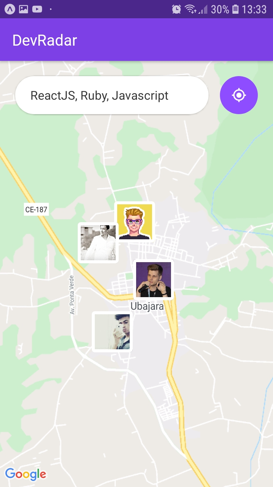
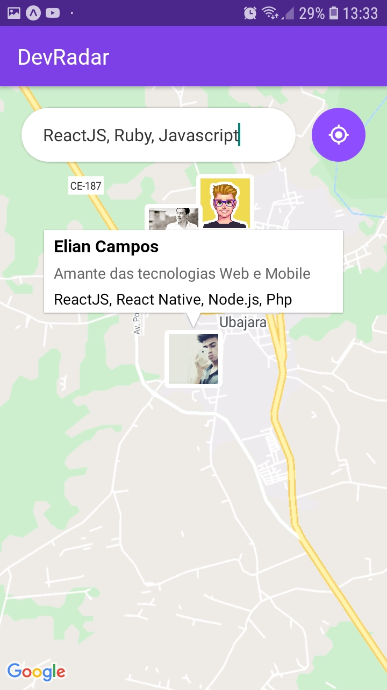
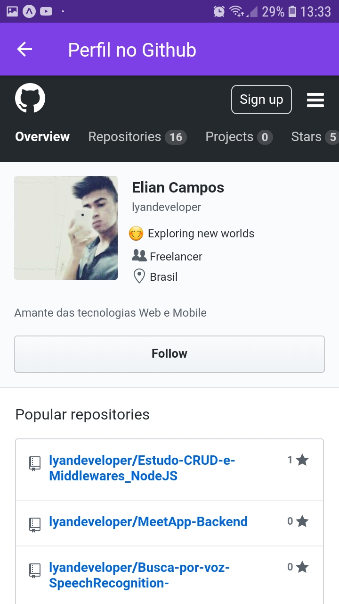
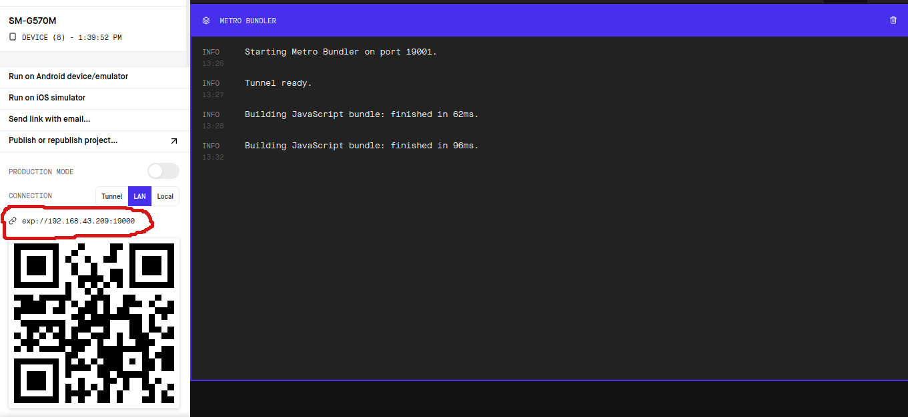
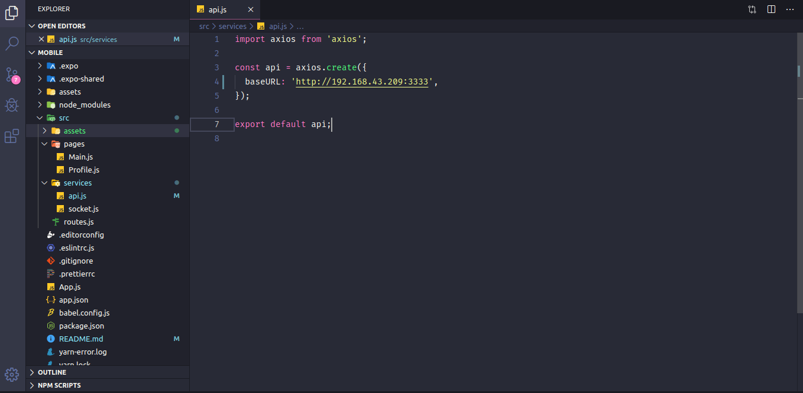

# DEVRADAR

**MOBILE DA APLICAÇÃO FEITA NA SEMANA OMNISTACK 10 DA ROCKETSEAT** </br>

Esta aplicação é feita em 3 partes usando conceito REST, backend, frontend e mobile usando as tecnologias NodeJS React React Native, e MongoDB como banco de dados.
Cuja ideia é permitir encontrar desenvolvedores a partir de suas tecnologias.

## Funcionalidades

- Pesquisar usuários filtrando por suas tecnologias
- Geolocalização atraveś de GPS e Wifi

## Como Funciona?

Na parte [WEB](https://github.com/lyandeveloper/DevRadar-frontend) o usuário coloca o nome de usuário do GitHub, cadastra as tecnologias que trabalha e na parte Longitude e Latitude o usuário não necessita preencher pois automaticamente o navegador pega a localização do mesmo.


Nesta parte Mobile <br/>


O contratador pesquisa filtrando por tecnologias para encontrar profissionais em um raio de 10km com as tecnologias que ele filtrou. <br/>


No mapa aparece o avatar dos profissionais e o contratador ao tocar sobre o avatar aparece o nome, descrição do usuário puxando do GitHub e tecnologias cadastradas. <br/>


Ao tocar sobre o balão automanticamente redireciona para a página do GitHub do profissional. <br/>


## Instalação

1. Crie uma pasta em qualquer lugar da sua máquina e clone a parte [BACKEND](https://github.com/lyandeveloper/DevRadar-Backend) do DevRadar abra no seu editor e no terminal rode o comando

```sh
yarn install ou npm install para instalar as dependências:
```

2. Depois rode o comando:

```sh
yarn dev ou npm run dev
```

3. Agora clone este repositório na mesma pasta que você criou, abra no seu editor e rode o comando:

```sh
yarn start ou npm start
```

4. Confira o endereço IP do seu dispositvo <br/>
   

5) Altere o endereço IP no src/services/api.js mas não altere o :3333 <br/>
   

6) Vá no app Expo no seu smartphone e escaneie o QRCode.
